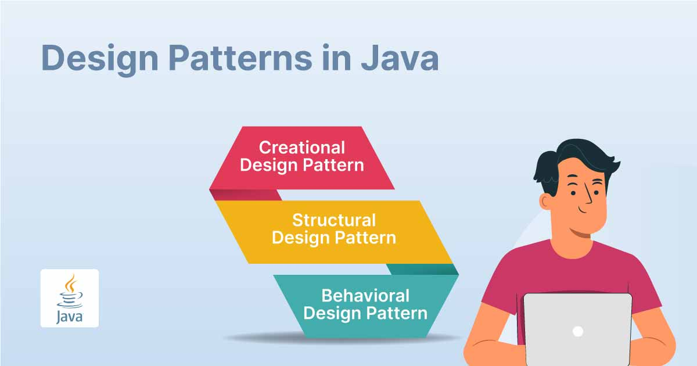

# Design Patterns in Java

This repository is dedicated to exploring various design patterns in Java, demonstrating their use and implementation through clear and concise examples. The patterns covered aim to solve common software design problems and improve the modularity and scalability of software applications.

## Authors

- [@AdrianTalonia](https://github.com/adriantalonia) - Java Fullstack Developer

## Tech Stack

- Java 21

## Design Patterns Covered

In this repository, we delve into several fundamental design patterns categorized by their purpose. Each pattern includes a separate directory containing the example code and a README explaining the context and usage of the pattern.

### Creational Patterns
1. Factory
2. Abstract
3. Singleton
4. Prototype
5. Builder

### Structural Patterns
1. Adapter
2. Bridge
3. Composite
4. Decorator
5. Facade
6. Flyweight
7. Proxy

### Behavioral Patterns
1. Chain Of Responsibility
2. Command
3. Interpreter
4. Iterator
5. Mediator
6. Memento
7. Observer
8. State
9. Strategy
10. Template
11. Visitor

## Installation

To run these examples, you need to have Java 21 installed on your machine.